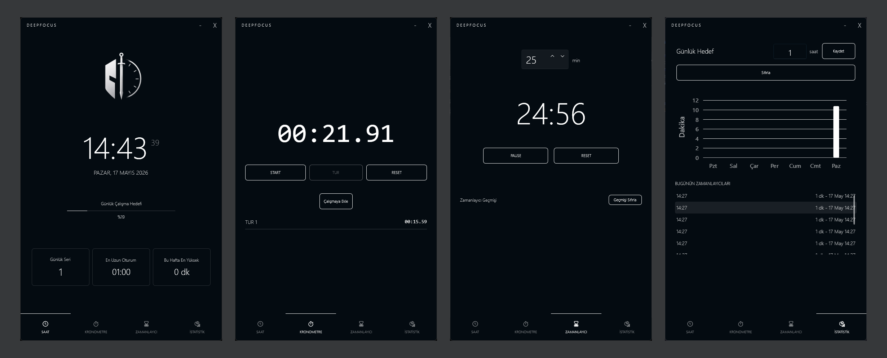

Hi, I'm Cengizhan Tavşanlı

## Education

**Selcuk University**, Management Information Systems 

Graduation:2027 

---

## Uygulamalarım 

**DeepFocus**

[Github Repo](https://github.com/tcengizhan/DeepFocus)

Bir Crusader ruhu taşıyan, vibe coding ile WPF .NET 8 üzerinde geliştirilmiş masaüstü verimlilik uygulaması.
Kronometre, zamanlayıcı, günlük hedef takibi ve haftalık istatistiklerle zaman kontrolünü optimuma çıkar.

---

## Skills

**Languages**: Python, C#

**Frameworks**:.NET Core, ASP.NET MVC

**Database**: MySQL
